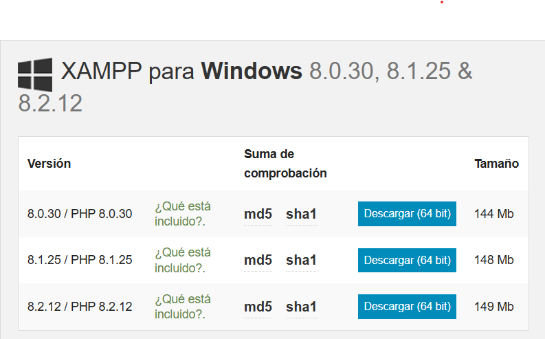
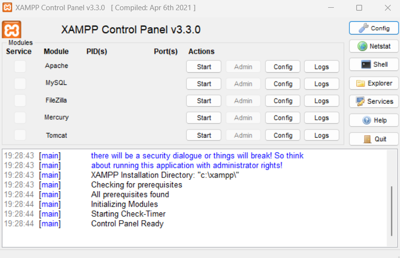
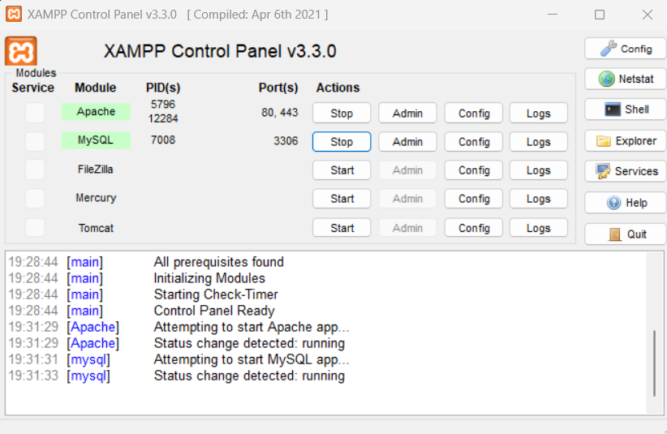
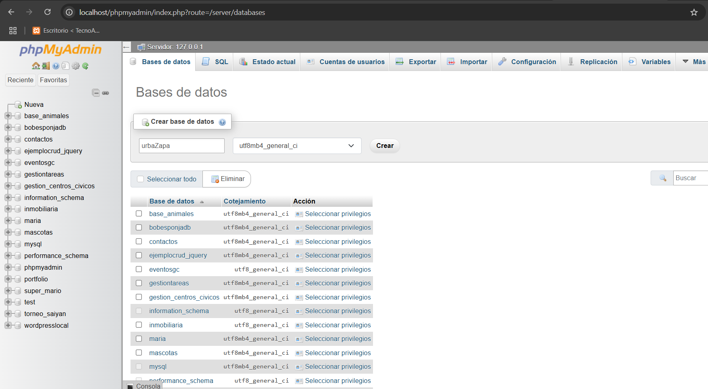
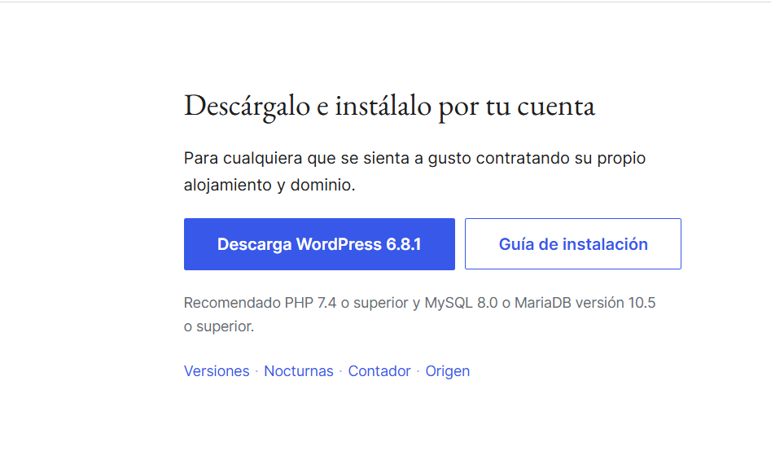
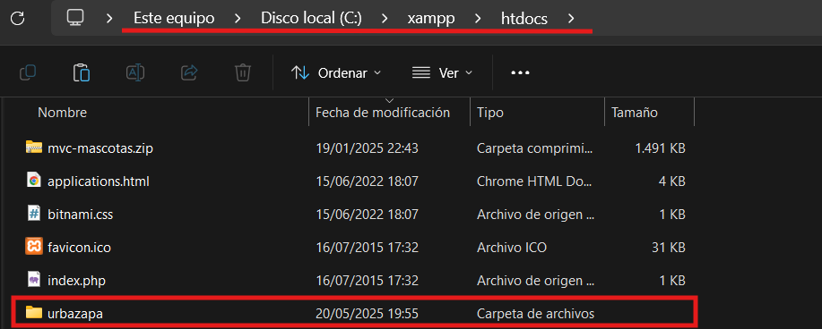
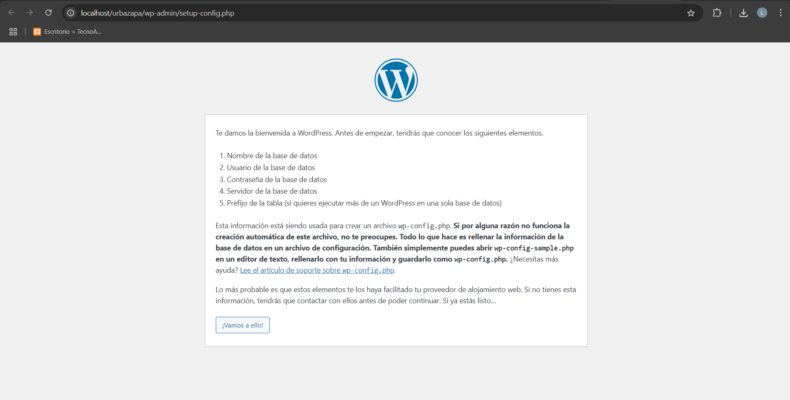
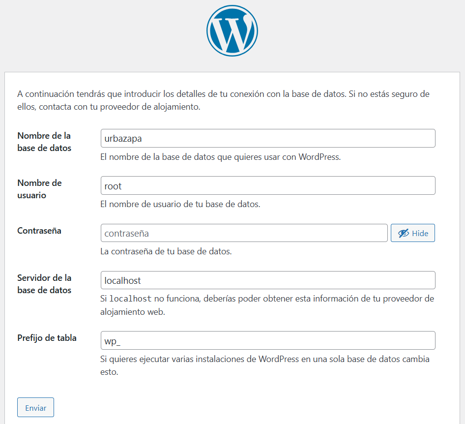
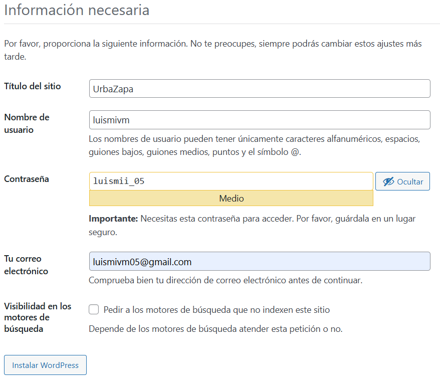
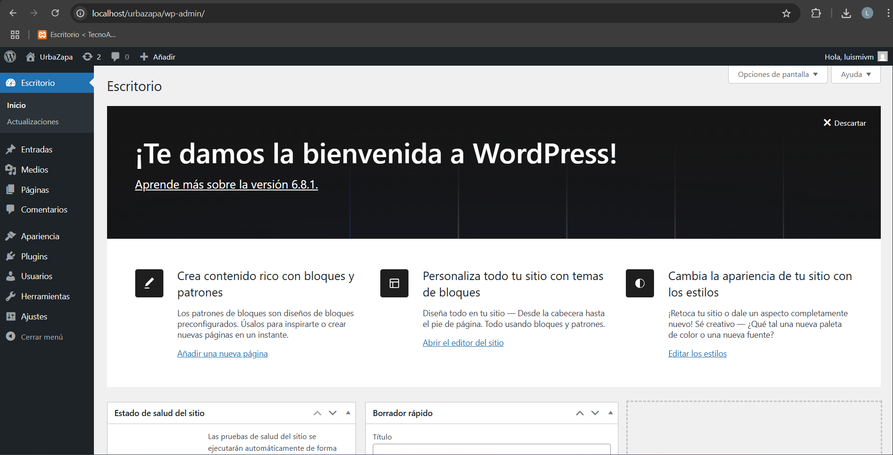

# Práctica 3. Intalaciación de Wordpress en Local
**Ciclo Formativo:** Desarrollo de Aplicaciones Web  
**Módulo:** Horas de Libre Configuración  
**Nombre y Apellidos del autor:** Luis Miguel Villén Moyano  
**Fecha:** 18-05-2025  

## 1. Descargar xampp
Lo primero que debemos hacer es instalar xampp en su web oficial:

Este seria la vista del programa xampp:

Activamos apache y phpmyadmin que es lo que nos va a servir para poder utiliazar nuestro wordpress local:

## 2. Crear Base De Datos para Wordpress

Accedemos a http://localhost/phpmyadmin, pulsamos la pestaña 'base de datos' y creamos nuestra base de datos y pulsamos crear:

## 3. Descargar WordPress

Nos vamos a la web oficial de WordPress y lo descargamos:

Descomprimimos la carpeta y la copiamos en C:\xampp\htdocs\, despues cambiamos el nombre de la carpeta por 'urbazapa':

Si nos vamos a http://localhost/urbazapa nos aparecera la instalacion de WordPress:

Rellenamos la informacion sobre nuestra base de datos:

Rellenamos informacion sobre el sitio:

Ahora accedemos a nuestro panel de wp con la credenciales creadas anteriormente:

# Política de Privacidad – Urbazapa

## Responsable

- **Empresa**: Urbazapa S.L.
- **Dirección**: Avenida del Conde Vallellano, 25, 14013 Cordoba
- **Email**: info@urbazapa.com

## Qué datos recogemos

- Nombre, email, dirección de envío y teléfono
- Datos de pago (a través de plataformas seguras)
- Información de navegación (cookies)

## Para qué usamos tus datos

- Procesar tus pedidos y envíos
- Atender consultas
- Enviar promociones si lo autorizas

## Seguridad

Protegemos tus datos con medidas técnicas adecuadas.

## Cambios

Actualizaremos esta política si hay cambios legales o de funcionamiento.

# Política de Cookies – Urbazapa

## ¿Qué son las cookies?

Son archivos que se guardan en tu dispositivo para recordar información sobre tu visita.

## Qué cookies usamos

- **Técnicas**: necesarias para que la web funcione
- **Analíticas**: para saber cómo se usa la web (ej. Google Analytics)
- **Publicitarias**: para mostrar anuncios relevantes

## Cómo puedes gestionarlas

Puedes aceptarlas, rechazarlas o configurarlas al entrar en la web. También puedes borrarlas desde tu navegador.

## Cambios

Podemos actualizar esta política en cualquier momento. La versión más reciente estará siempre disponible en esta página.

