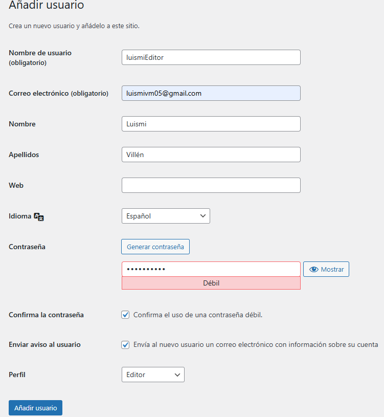
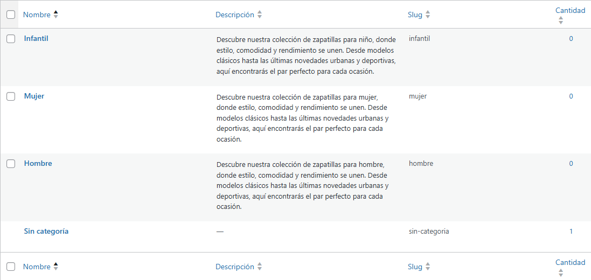
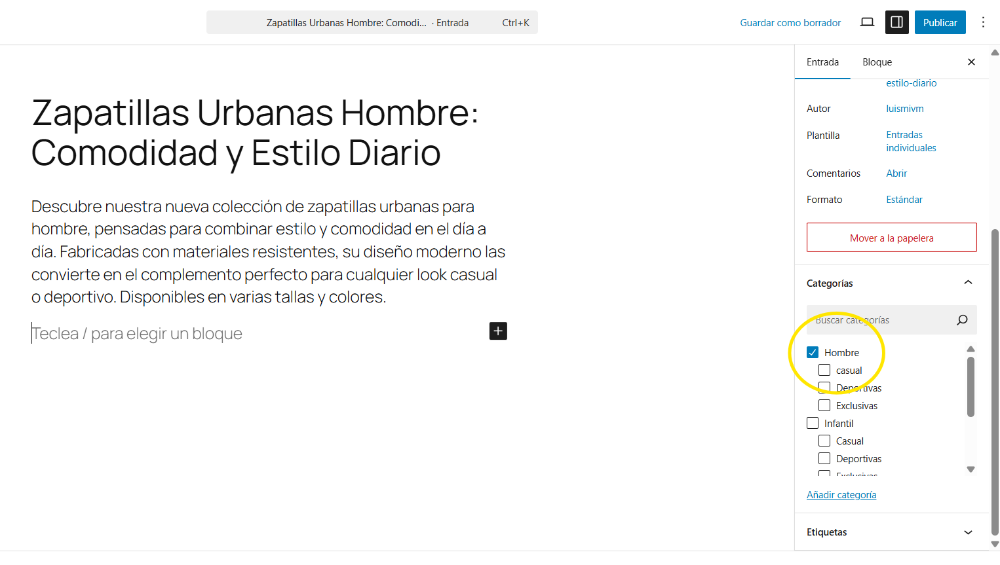
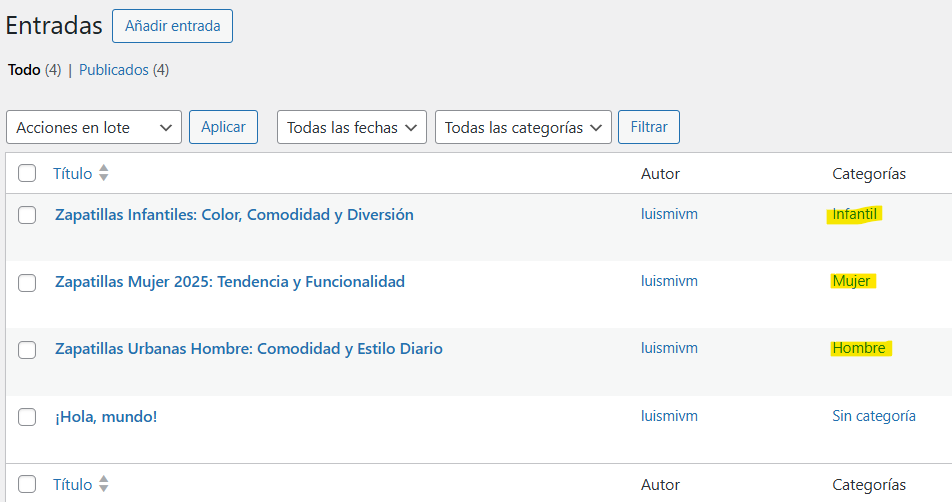
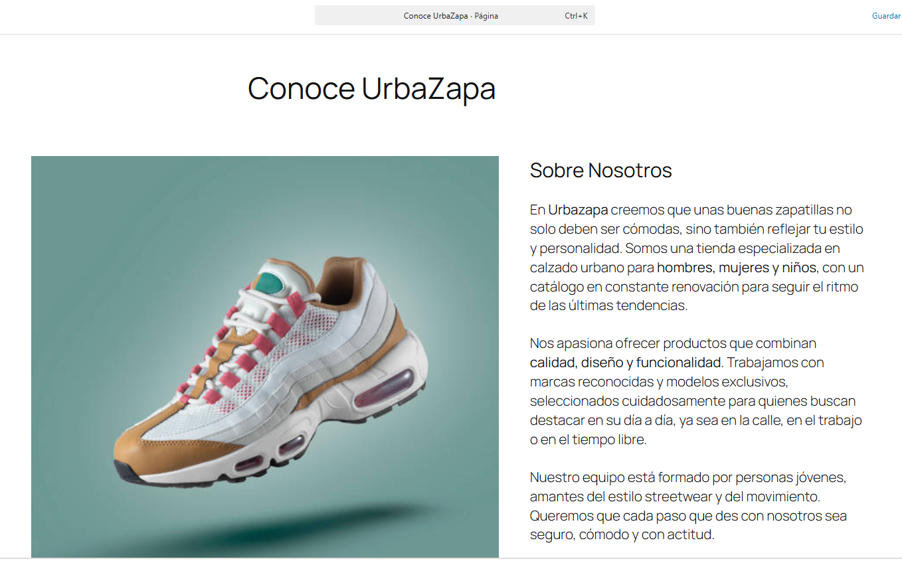
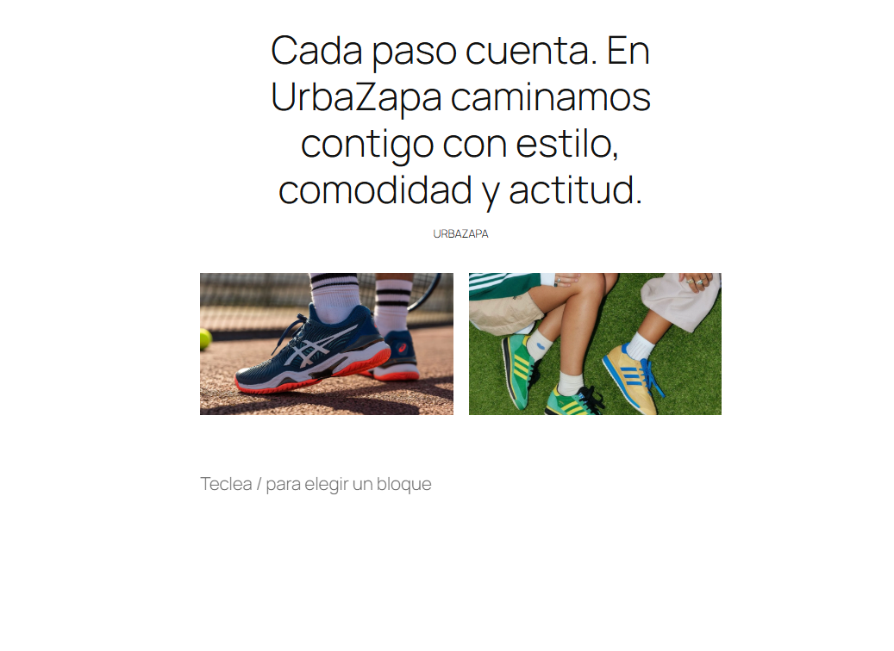

# Práctica 4. Creando contenido en WordPress
**Ciclo Formativo:** Desarrollo de Aplicaciones Web  
**Módulo:** Horas de Libre Configuración  
**Nombre y Apellidos del autor:** Luis Miguel Villén Moyano  
**Fecha:** 19-05-2025 

## 1. Crea un usuario Editor
Para crear un usuario editor, desde el panel de WP nos tendremos que ir a 'usuarios' y pulsar 'Añadir Usuario' y rellenar los input de informacion sobre el usuario y en la seccion 'perfil' elegir el rol de 'editor' 

y pulsamos 'añadir usuario'.

## 2. Crea 3 Categorías principales y que alguna contenga una o varias Subcategorías.

Para crear categorías en el panel de WP, nos tendremos que ir a la sección de 'Entradas' y dentro de esta, pulsar 'categorías' y rellenar los inputs para añadir una categoría:

Para las 3 categorías principales he elegido:

Hombre - Mujer - Infantil

y por cada categoría he añadido a cada una las siguientes subcategorias:
Deportivas - Casual - Exclusivas

## 3. Entra como Editor y crea 3 Entradas Nuevas con contenido relacionado con lo que vendes en tu web y asigna a cada Entrada la Categoría que le corresponda

Para crear entradas nos tendremos que dirigir a la seccion de 'Entradas' en el panel de WP y despues pulsamos 'Añadir Entrada', hay la creamos y seleccionamos que categoría le corresponde:

Esto lo haremos tambien con Mujer y con Infantil asignandole su correspondiente categoría:

## 4. Crea la página Sobre Mí o Sobre Nosotros o Conócenos (dependiendo de como sea tu web), con variedad de contenido: mínimo que contenga 3 párrafos, 2 imágenes, 1 cita . 

Para crear una pagina nos vamos a la seccion 'paginas' y pulsamos 'Añadir Pagina', añadimos parrafos imagenes y una cita:

