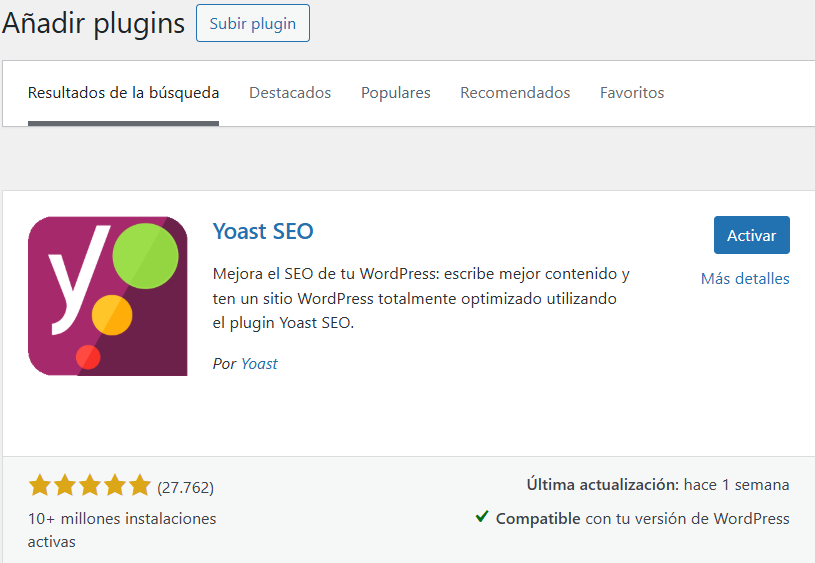

# Práctica 5. WooCommerce en WordPress
**Ciclo Formativo:** Desarrollo de Aplicaciones Web  
**Módulo:** Horas de Libre Configuración  
**Nombre y Apellidos del autor:** Luis Miguel Villén Moyano  
**Fecha:** 19-05-2025 

## 1. Descarga un tema gratuito y súbelo a tu WordPress, y actívalo.

Para descargar un tema y subirlo a WP no vamos a la seccion 'Apariencia' y pulsamos en 'temas' pulsamos el tema que deseemos y pulsamos instalar (Yo he instalado 'ASTRA'):

Despues de terminar de instalarse, pulsamos activar:

## 2. Instala los siguientes Plugins:

Para instalar plugins nos vamos a 'plugins' y pulsamos 'Añadir plugins', buscamos el que queramos y pulsamos 'instalar ahora', y despues 'activar':

a) Formulario de Contacto: WPForms:

b) Cookies: Complianz:

c) SEO: YoastSEO (Yoast SEO es un plugin de WordPress que te ayuda a mejorar el posicionamiento de tu web en buscadores como Google, optimizando títulos, descripciones, palabras clave y la legibilidad de tus contenidos):

d) WooCommerce (El plugin más usado para crear una tienda en WordPress.):

e) Wordfence Security (Protección contra malware y ataques.):

## 3. Activa los plugins que acabas de instalar y configúralos para adaptarlos a tu web.
Cookies:

WPForm:

YoastSEO:

## 4. Crea la página de Contacto y añade ahí el formulario de Contacto y la ubicación con un Google Maps incrustrado en la página.

