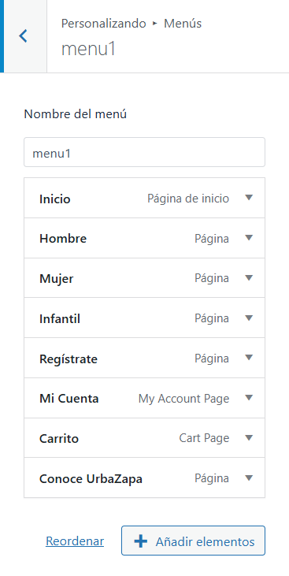
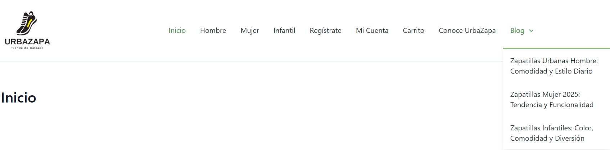
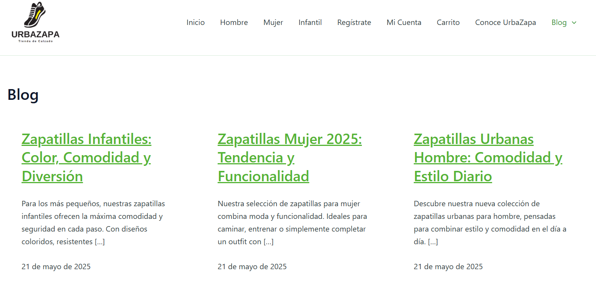
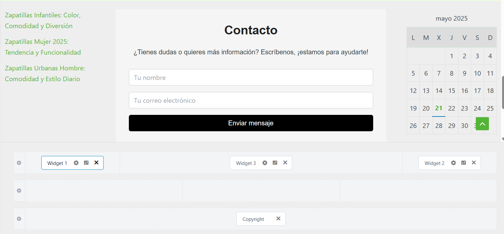
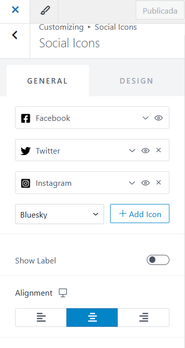
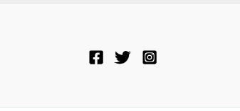

# Práctica 6. Jerarquía y estructura de archivos/carpetas de WordPress
**Ciclo Formativo:** Desarrollo de Aplicaciones Web  
**Módulo:** Horas de Libre Configuración  
**Nombre y Apellidos del autor:** Luis Miguel Villén Moyano  
**Fecha:** 20-05-2025 

## 1. Crea las nuevas páginas para completar tu web, deberías tener al menos: Inicio, Sobre nosotros, Servicios ( o alguna otra relacionada con tu web, con dos páginas submenús, por ejemplo Presencial, Online), Contacto, Localización (en el caso de que quieras separar la localización) y Blog.

Aqui estan las paginas que voy a utilizar:

y asi saldrían en el menu:

## 2. Crea un menú principal en el que se pueda acceder a todas tus páginas. La página Servicios (o la que corresponda) no debe de visualizar nada, sólo las páginas hijas y el blog debería mostrar las entradas que creaste.

Menu principal:

Blog con las entradas:

## 3. Añade 3 Widgets al pie de página y en el lateral, en el que se muestre tus últimas entradas, un calendario y datos de contacto.

Añado los widget de las ultimas entradas, informacion de contacto y calendario pulsando en 'personalizar':

## 4. Añade iconos de redes sociales y algún widget de tu facebook o instagram para visualizar las últimas publicaciones.

Añadimos en el pie de pagina las redes sociales:

y así quedaría:

